[](https://classroom.github.com/a/YyUO0xtt)
# COMP2150  - Level Design Document
### Name: Abeer Atif
### Student number: 47329165

This document discusses and reflects on the design of your platformer level for the Level Design assessment. It should be 1500 words. Make sure you delete this and all other instructional text throughout the document before checking your word count prior to submission. Hint: You can check word count by copying this text into a Word or Google doc.

Your document must include images. To insert an image into your documentation, place it in the "DocImages" folder in this repo, then place the below text where you want the image to appear:

```

```

Example:


## 1. Player Experience (~700 words)
Outline and justify how your level design facilitates the core player experience goals outlined in the assignment spec. Each section should be supported by specific examples and screenshots of your game encounters that highlight design choices made to facilitate that particular experience.

### 1.1. Discovery
What does the player learn? How does your encounter and broader level design facilitate learning in a way that follows good design practice?

In the first section, the player learns the mechanics of the game - how to recognise obstacles, manouevre though the level and combat enemies. Each encounter has a clear objective. 

For example, the first encounters teach the player that the spikes and acids must be avoided to preserve their health. This is done by allowing them to experiment with jumping over them or touching them. Players are allowed to make mistakes with the checkpoints placed before the encounter which will help them if they lose their health.

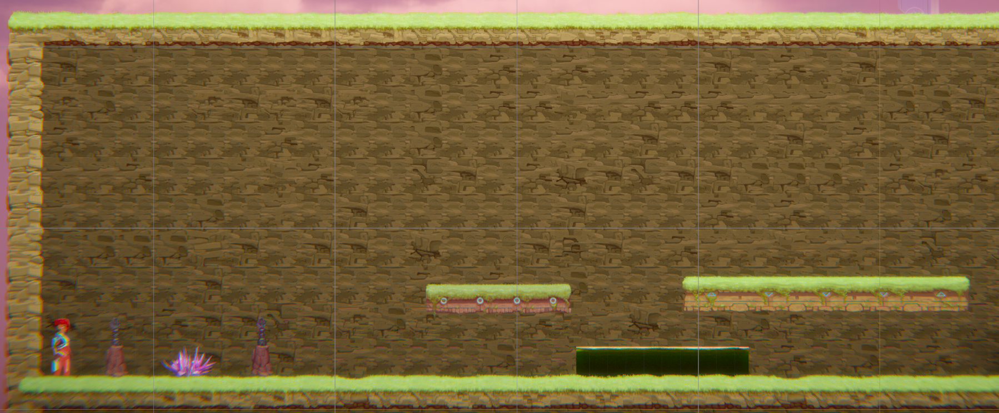

Another example is the encounter where the player learns how to jump below passthrough platforms and how to use the staff for short range attack. The pillars placed on the left side of the platform force the player to jump below the platform. Then, the player is forced to attack the pillar placed on the right of the platform with the staff in order to advance to the next encounter.


One more example is when the player learns to use the gun for long range attacks. The player is forced to use the gun to attack the spitter before it attacks them as the acid is placed before the spitter, disallowing the player to attack with the short ranged staff. This strategic placement allows the player to learn this mechanic of the game.

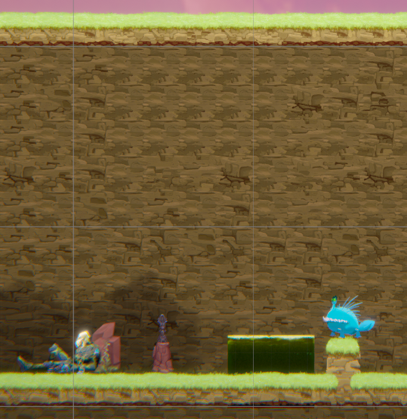

### 1.2. Drama
What is the intensity curve? How does your design facilitate increasing yet modulating intensity, with moments of tension and relief? 

Throughout the difficulty curve, there is a modulated increase in difficulty which strikes a balance in between anxiety and boredom where the player becomes engaged and in a flow channel. As the skill increases, the level is not too easy or difficult, which ensures the flow will not be broken.

The rising action in the intensity curve is when the early encounters in section one start with manageable challenges, gradually introducing mechanics and enemies.

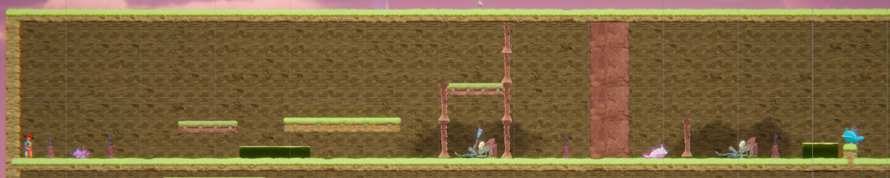

The climax in the intensity curve is when the player must weave through the platforms and obstacles and fight enemies using both short ranged and long ranged attacks. These challenges result in a high level of tension, pressure, urgency and excitement.

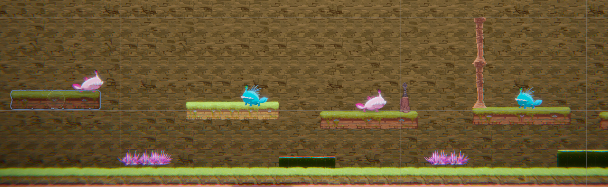

The falling action is when there is a moment of relief as the section becomes easier near the end and the key is obtained. The resolution is when all three keys are obtained and the game is finished. These both provide relief to the player and satisfaction.

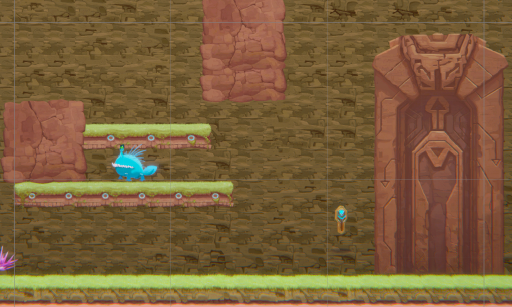

### 1.3. Challenge
What are the main challenges? How have you designed and balanced these challenges to control the difficulty curve and keep the player in the flow channel?

The main challenges are fighting the enemies while avoiding obstacles and jumping from platform to platform. This can be difficult when there are multiple enemies or when you must break the pillars in mid-air to advance to the next encounter or when you must jump below the pass-through platform in before the spitter attacks you completely. These challenges are introduced gradually within the game to ensure the player's skill level is aligned with the difficulty. Players are kept in the flow channel by ensuring they are focused and engaged. This is done by playtesting and adjusting the difficulty so that it is not too hard or easy.

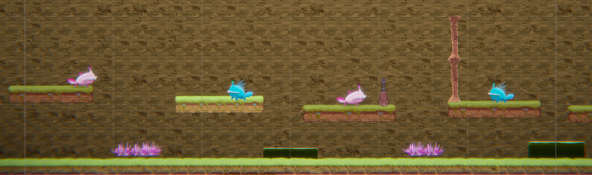

### 1.4. Exploration
How does your level design facilitate autonomy and invite the player to explore? How do your aesthetic and layout choices create distinct and memorable spaces and/or places?

The level design allows the player to explore and attack the enemies in a non-linear way in the encounters. For example, the player could jump over an enemy and proceed to the next platform, attack the next enemy and then return to the previous enemy.

The placement of platforms, obstacles and enemies are unique as these enhance the learning of mechanics in the game and the player’s enjoyment. Hence, these become distinct, memorable spaces.

It would have been better if I could have implemented aspects to the game that would allow for a greater sense of exploration. For example, it could have been improved by adding different places or routes the player can explore, instead of having a linear path.

## 2. Core Gameplay (~400 words)
A section on Core Gameplay, where storyboards are used to outline how you introduce the player to each of the required gameplay elements in the first section of the game. Storyboards should follow the format provided in lectures.

Storyboards can be combined when multiple mechanics are introduced within a single encounter. Each section should include a sentence or two to briefly justify why you chose to introduce the mechanic/s to the player in that sequence.

You should restructure the headings below to match the order they appear in your level.

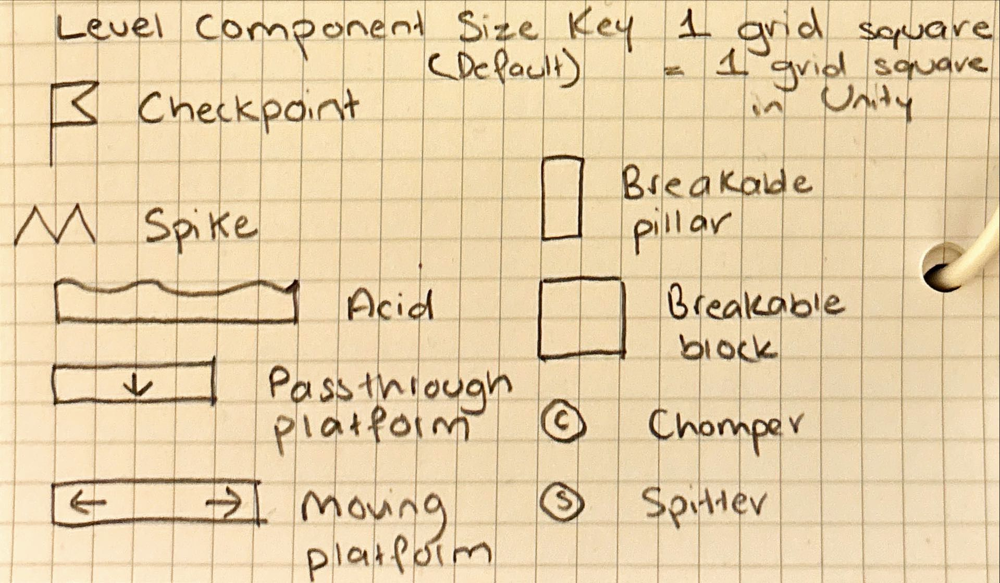
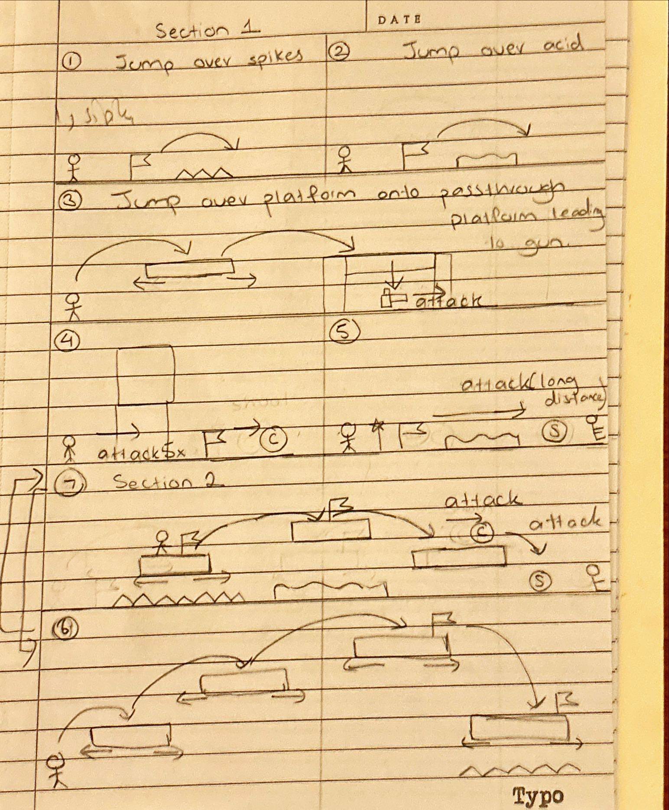
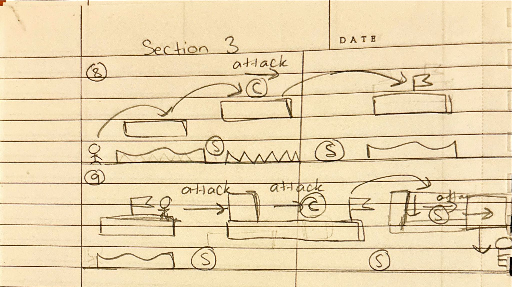

### 2.1. Checkpoints
There is a checkpoint placed before the spikes and acid. This ensures that even if the player touches the spikes or acid and incurs damage, they can reset to the checkpoint and try again. This ensures they can experiment with the mechanics of the game and learn in a safe environment.

### 2.2. Acid & Spikes
The player may make contact with the spikes, causing damage to their health. This will teach them that the spikes are obstacles to be avoided. They will learn to jump over the spikes as intended in order to advance through the level.

### 2.3. Moving Platforms
The player has to jump onto the moving platform and onto the next passthrough platform, which is placed at a height that ensures the player cannot simply jump onto it from otno the ground. This forces the player to learn how to use the moving platform. 

This is also made easy for the player by ensuring there are no obstacles such as acid, spikes or enemies in their way. 

### 2.4. Passthrough Platforms & Weapon Pickup (Gun)
Once the player has jumped onto the passthrough platform, they must jump below it in order to obtain the gun and attack the pillar in order to advance to the next encounter. The placement of the pillars around it ensures that the player must learn to use the passthrough platform rather than avoiding it.

### 2.5. Chompers
After recieving the staff, there is a singular chomper to attack. There are no other obstacles around it, which ensures that this mechanic is simple to understand and execute.

### 2.6. Weapon Pickup (Gun) & Spitters
After the player learns to use the staff by breaking blocks and pillars with it, they earn a new weapon - the gun. Then, there is a spitter standing on a dirt block which is at the right height to be in range of the gun. Acid is placed here so the player must use the long range attack witht the gun.

### 2.7. Keys
One key is placed at the end of each section as the reward for advancing through the level. It provides a sense of relief and satisfaction and allows the player to go through the door at the end of the level in order to finish it.

### 2.8. Health Pickups
The health pickups are placed at the end of each section in order to ensure the player can regain enough health to proceed with the next section. The number of health pickups decrease at the end of the second section in order to increase the challenge in the difficulty curve.

## 3. Spatiotemporal Design
A section on Spatiotemporal Design, which includes your molecule diagram and annotated level maps (one for each main section of your level). These diagrams may be made digitally or by hand, but must not be created from screenshots of your game. The annotated level maps should show the structure you intend to build, included game elements, and the path the player is expected to take through the level. Examples of these diagrams are included in the level design lectures.

No additional words are necessary for this section (any words should only be within your images/diagrams).
 
### 3.1. Molecule Diagram

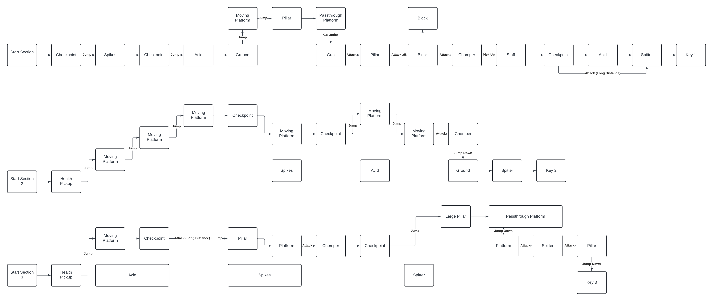
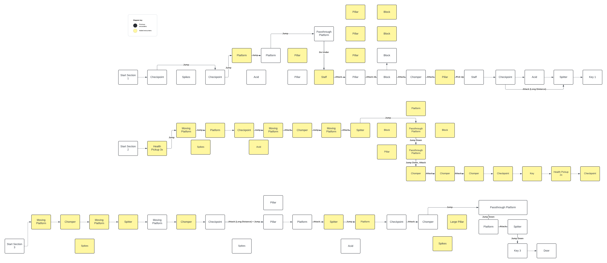

### 3.2. Level Map – Section 1 & Section 2


### 3.4.	Level Map – Section 3


## 4. Iterative Design (~400 words)
Reflect on how iterative design helped to improve your level. Additional prototypes and design artefacts should be included to demonstrate that you followed an iterative design process (e.g. pictures of paper prototypes, early grey-boxed maps, additional storyboards of later gameplay sequences, etc.). You can also use this section to justify design changes made in Unity after you drew your level design maps shown in section 3. 

You should conclude by highlighting a specific example of an encounter, or another aspect of your level design, that could be improved through further iterative design.

After drawing my storyboard and molecule diagram, I began implementing the design in my level. After I created each encounter, I playtested it and found there were some things that needed to be changed. Then, I modified the storyboard and molecule diagram to reflect the changes I wanted to make before implementing it in Unity. 


For example, I changed the first moving platform to be a pass through platform in order to make it easier for the player to learn how to jump onto a platform at first. I placed a pass through platform to ensure the platform does not move, not so that the player can jump below it.

Then, I added two pillars instead of one in the third encounter to ensure the player does not simply skip the encounter by jumping over one pillar. 

Then, I had to put the spitter on top of a dirt tile to ensure it is in range for the player to shoot, which could not be foreseen in the early stages of the process without playtesting. 

I noticed I did not include any health pickups in my design so I added three after the first section and two after the second section. This ensures that the player can easily regain health to attempt the next section, while having one less health pickup afterwards increases the difficulty.

After playtesting with someone who was not too experienced in playing video games, I gained insights that I would not have otherwise since I was used to playing my level repeatedly. They found that it was too hard and discouraging trying to jump over each platform with the obstacle (acid or spikes) directly underneath it. So, I made it so it was in between the platforms instead. This improved the difficulty curve.

Hence, I was able to improve my level design through iterative design.

I could have further improved the difficulty curve by placing the encounter at the end of the second section in a more strategic manner. I feel like it may have been too difficult for section two, although it could have helped in providing a variation in the difficulty curve instead of having a linear curve of easy to difficult. Placing it at the beginning of section three would improve the game.

## Generative AI Use Acknowledgement

Use the below table to indicate any Generative AI or writing assistance tools used in creating your document. Please be honest and thorough in your reporting, as this will allow us to give you the marks you have earnt. Place any drafts or other evidence inside this repository. This form and related evidence do not count to your word count.
An example has been included. Please replace this with any actual tools, and add more as necessary.


### Tool Used: ChatGPT
**Nature of Use** Understanding the key concept of the intensity curve.

**Evidence Attached?** Screenshot of Bing AI conversation included in the folder "DocImages" in this repo. 
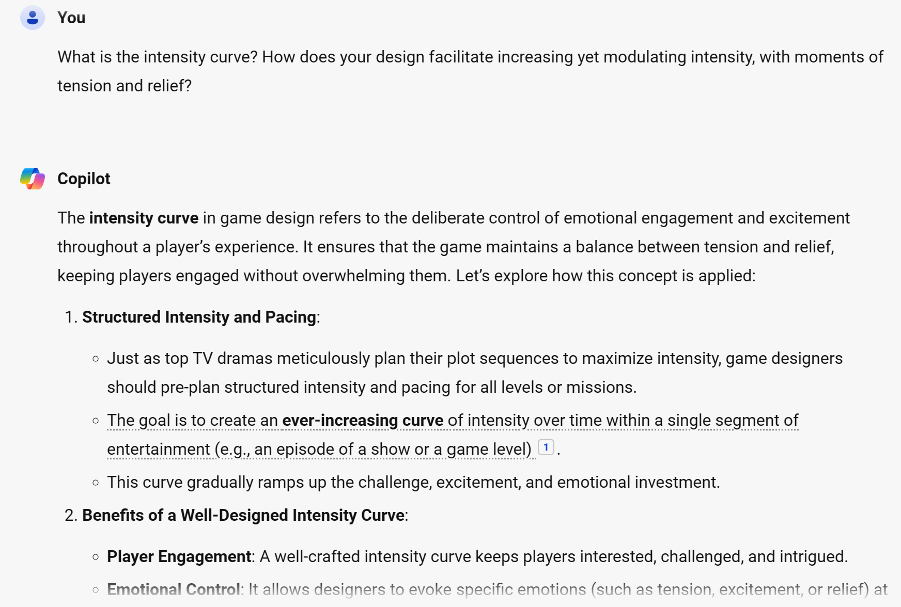
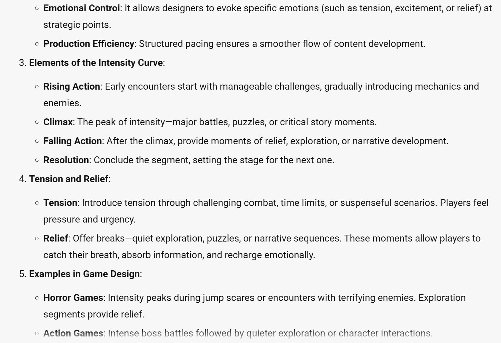
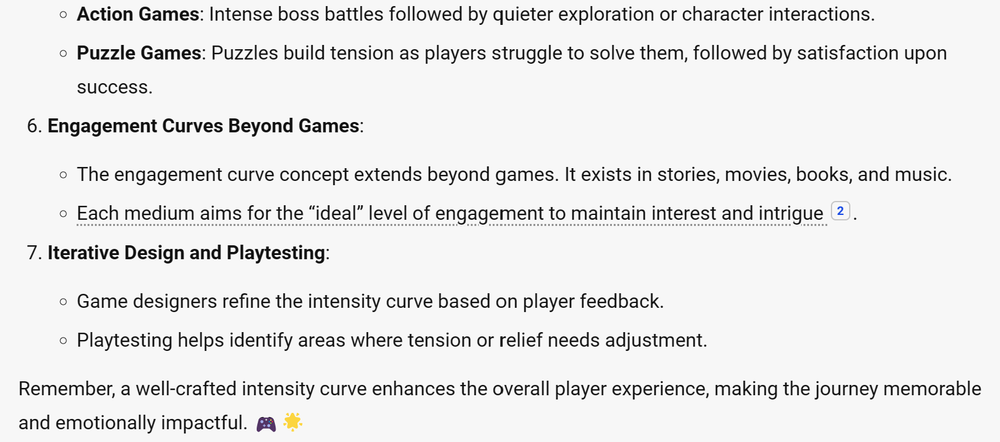

**Additional Notes:** I used Bing AI to understand key words and concepts about the intensity curve.

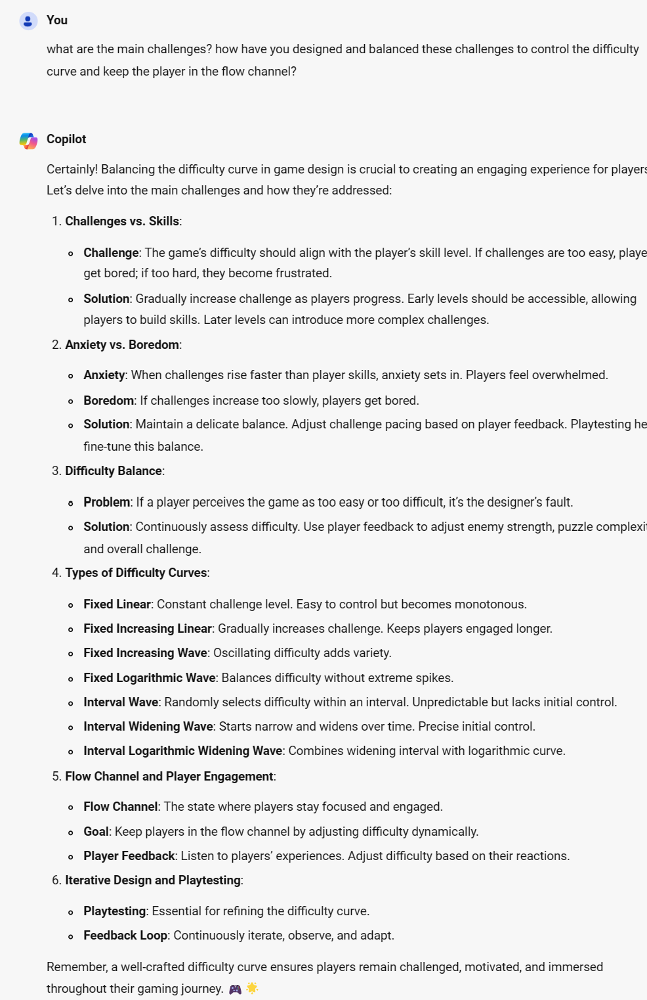


